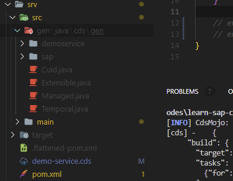
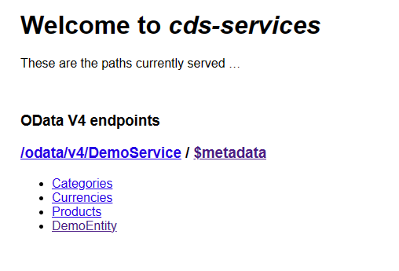
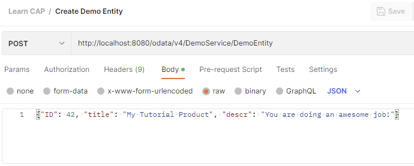

# 前置内容
首先，得明白什么是CAP。用我自己的话来讲，CAP是SAP推出的、适配Cloud Native的编程框架。它提供了一系列架构层面的抽象，并提供了基于Nodejs和Java两个技术栈的实现。
   
CAP的官方网站，点击[链接](https://cap.cloud.sap/docs/)访问。
   
其次，CAP的实现中，很大程度上集成了SAP这些年来的技术方案。譬如，CAP开发的Service或者API，可以很方便的提供oData的语义。oData是微软提出来的基于REST的语义解释框架，详情参阅[oData官方网站](https://www.odata.org)。

再次，在本地开发CAP，需要的一些基本组件及其安装。

本文中使用如下软件或插件：
- Visual Studio Code。
- Visual Studio Code插件
	- Extension Pack for Java
	- SAP Fiori Tools - Extension Pack
	- Spring Boot Extension Pack
	- SAP CDS Language Support
- Maven
- Nodejs and NPM
- NPM packages
 	-  @sap/cds-dk	

当然，在国内的网络环境，常用nodejs和maven的mirror设置都要设置好——这能极大的提升开发效率。

# 现在，开始创建一个Project

现在可以创建一个project了。

## 创建Project的几种方式

### 使用Maven命令    

可以使用如下的Maven命令：

```Powershell
mvn org.apache.maven.plugins:maven-archetype-plugin:3.1.2:generate -DarchetypeArtifactId="cds-services-archetype" -DarchetypeGroupId="com.sap.cds" -DarchetypeVersion="1.32.0" -DgroupId="com.alvachien.learncap" -DartifactId="demo-service"
```

### 使用Visual Studio Code

打开Visual Studio Code的 `Command Palette...`，输入 'Java: Create Project'，在列表中选择'Maven: create from archetype'。

在弹出对话框中输入archetype: `cds-service-archetype`

### CDS SDK命令

使用CDS SDK的命令同样可以创建一个Project。  

```cmd
cds init demo-service --add java
```

注意，·cds·其实是nodejs的命令。所以，我理解里面，SAP CDS自身的Tools都是基于Nodejs的。


# 为新建的Project添加一个Service
   
## 在`srv`文件夹下新建一个cds文件

该cds文件定义`DemoService`，并为其添加一个Entity。这里，Entity的概念来自于oData。可以自行查看oData的文档。

```cds
service DemoService {
    entity DemoEntity {
        key ID: Integer;
        title: String(111);
        descr: String(1111);
    }
}
```
## 添加Service的实现

在`Application.java`文件的同层，创建一个`handlers`的文件夹，并创建一个`DemoService.java`的文件：

```java
package com.alvachien.learncap.demoservice.handlers;

import java.util.HashMap;
import java.util.Map;

import org.springframework.stereotype.Component;

import com.sap.cds.services.cds.CdsCreateEventContext;
import com.sap.cds.services.cds.CdsReadEventContext;
import com.sap.cds.services.cds.CdsService;
import com.sap.cds.services.handler.annotations.On;
import com.sap.cds.services.handler.annotations.ServiceName;

@Component
@ServiceName("DemoService")
public class DemoService {
    private Map<Object, Map<String, Object>> dataInMemory = new HashMap<>();

    @On(event = CdsService.EVENT_CREATE, entity = "DemoService.DemoEntity")
    public void onCreate(CdsCreateEventContext context) {
        context.getCqn().entries().forEach(e -> dataInMemory.put(e.get("ID"), e));
        context.setResult(context.getCqn().entries());
    }

    @On(event = CdsService.EVENT_READ, entity = "DemoService.DemoEntity")
    public void onRead(CdsReadEventContext context) {
        context.setResult(dataInMemory.values());
    }    
}
```

## 编译项目   

运行maven命令来编译项目。   

```Powershell
mvn clean install
```

命令运行成功后，项目中添加了一堆文件，主要在 `srv/src/resources/edmx` 下。



# 运行及测试

## 运行项目


运行项目来启动Service。

```Powershell
mvn clean spring-boot:run
```



打开`$metadata`链接可以查看详细的Odata Metadata文件。

这比之前的Olingo 项目容易太多，当然Olingo项目也是SAP开发并捐献给Apache孵化的。

## 测试项目

这个Service已经可以正常运行。
使用Postman来测试该项目。


