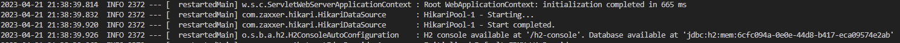
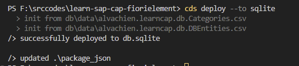
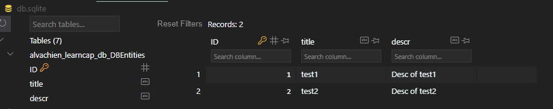

# 前期准备
  
根据SAP CAP的官方文档，CAP可以非常容易地添加数据库坚持。然而，所有的数据库中，支持得最好的当然是SAP自家的HANA数据库。可惜，SAP HANA数据库作为企业级数据库，无论版权、安装环境都不是本地环境能支持的。所以本篇中使用Sqlite作为数据库。

值得提醒的是，SAP CAP生成的Java项目，在没有指定数据库的情况下，默认使用H2 In-memory数据库。



另外，一个有意思的点是，SAP官方文档中提及：
> The CAP Java runtime is tested with PostgreSQL 12.

但是使用PostgreSQL通常搭建一个Docker，这个虽然很容易，但是简单起见，还是使用Sqlite吧。

首先，安装sqlite数据库。在项目文件夹下运行NPM指令：

```cmd
npm i -D sqlite3
```

其次，在Visual Studio Code中，安装额外的Plugin：

- Sqlite Viewer

这个Plugin允许在Visual Studio Code直接打开Sqlite文件。因为我们在这个Service中只需要对数据库进行查看，所以安装一个Viewer就足够了。

# 添加一个基于数据库表的Entity 

## 创建db文件夹

在项目的根目录中，创建`db`文件夹。

### 创建`schema.cds`文件

创建`schema.cds`，并添加如下的Entity：

```cds
entity DBEntities {
    key ID : Integer;
    title  : String(111);
    descr  : String(1111);
}
```

### 初始化数据库表

CAP还支持对数据库的表进行初始化。这个初始化需要对应的`csv`文件。   
首先，在`db`文件夹中，添加`data`文件夹。    
其次，在`data`文件夹中添加文件`DBEntities.csv`：    

```csv
ID;title;descr
1;test1; Desc of test1
2;test2; Desc of test2
```

# 在Service中引用刚刚创建的Entity

## 修改Service Definition

修改Service Defintion的cds文件。

```cds
service DemoService {
    @cds.persistence.skip: true
    entity DemoEntity {
        key ID: Integer;
        title: String(111);
        descr: String(1111);
    }

    entity DBEntities as projection on DBEntities;
}
```

注意，这里在上篇的`DemoEntity`中加上了`@cds.persistence.skip: true`的annotation。这里的目的确保框架不需要为该Entity创建数据库表。

# 创建数据库

现在，可以创建数据库了。

```cmd
cds deploy --to sqlite:./srv/src/main/resources/db/sqlite.db
```

执行上述命令之后，会在项目的目录`srv/src/main/resources/db`下创建了`sqlite.db`文件。

可以在Visual Studio Code打开该文件来查看对应的数据库表是不是已经创建成功。还可以查看数据库中是否已经有初始化数据。






这时可以发现`package.json`文件已经发生修改：  

```json
  "cds": {
    "requires": {
      "db": {
        "kind": "sqlite",
        "credentials": {
          "database": "./srv/src/main/resources/db/sqlite.db"
        }
      }
    }
  }
```

# 修改程序，让程序使用刚刚创建的数据库文件

文章开头已经提及，默认Java项目会使用H2数据库。所以，要使用Sqlite，需要配置
`application.yml`文件：

```yml
---
spring:
  datasource:
    url: "jdbc:sqlite::resource:db/sqlite.db"
    driver-class-name: org.sqlite.JDBC
    hikari:
      maximum-pool-size: 1
```

# 运行程序

通过Maven命令来运行程序，并指定使用`sqlite`：

```cmd
mvn spring-boot:run
```

这时还可以使用Postman来进行测试，并确认数据库表是不是被更新。虽然一行代码没写，`SAP CAP`已经全部默认实现了。
