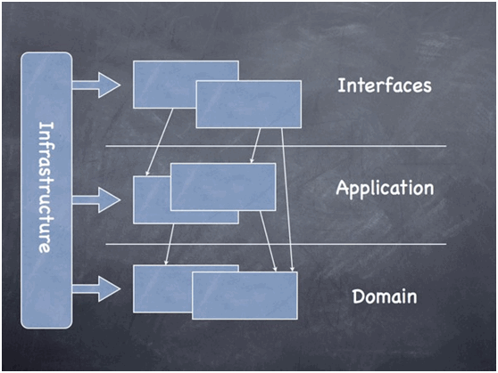
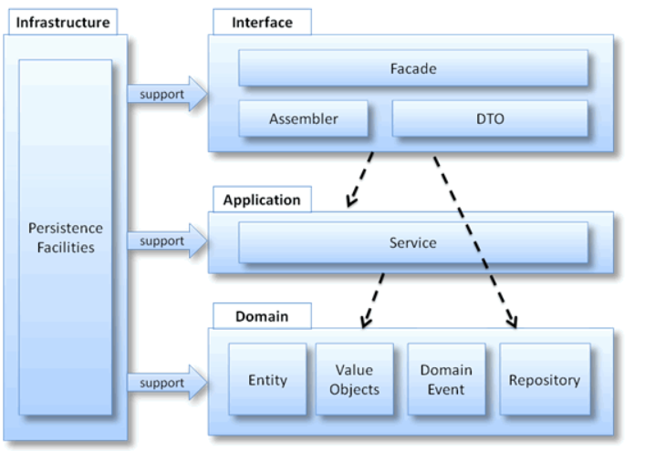

# 理解CAP的Model

继续额外的开发之前，需要了解下SAP CAP的Model的理念。

SAP CAP的Model，是通过SAP CDS来实现的。关于SAP CDS的具体内容，参阅[官方文档](https://cap.cloud.sap/docs/cds/)。本文只是试图提炼其中比较基础及比较关键的几个部分。

总的说来，SAP CAP中Model的核心理念为包括以下几部分。

## Domain-Driven Design

所谓的Domain-Driven Design 的缩写为DDD。通常认为DDD的概念起源于2004年`Eric Evans`的书籍《领域驱动设计》。其中，第一个D表示Domain，直译为领域，表达的其实是业务为先的理念。譬如，财务领域的凭证，需要保证所有行项目的金额总和为0，即“有借必有贷，借贷必相等”的领域需求。所以在建模（model）的时候，需要考虑反映Domain的业务概念。



至于别的DDD的概念，譬如：Service, Module，等，参阅DDD相关的书籍或文档。




## KISS

KISS是“Keep it simple, stupid!”的缩写，是另外一个SAP CAP遵循的Design原则。针对此原则，SAP CAP强调了下述关键项：

> **clean** = don’t pollute them with technical details。建模时尽量避免加入太多技术细节。    
> **concise** = be on point, use short names, simple flat models, etc. 模型应该简洁明了，避免长名称。   
> **comprehensible** = domain modeling is a means to an end; your clients and consumers are the ones who have to understand and work with your models the most, much more than you as their creator. Keep that in mind and understand the tasks of domain modeling as a service to others. 模型关键是便于使用者理解。

## Basic Types

SAP CDS的基础类型：

[Built-in Type](https://cap.cloud.sap/docs/cds/types)


## Common Reuse Type

SAP CDS提供了许多可重用的对象，包括Type, Aspect等等。详情请参阅[官方文档](https://cap.cloud.sap/docs/cds/common)。


这里，仅罗列下常用的有：
- cuid
- managed
- temporal
- Country, Currency, Language
- codeList

### `cuid`

`cuid`用来定义用UUID作为key的Entity，并且该key的名称为`ID`。

```cds
entity TestObject: cuid {
    ...
}
```

等同于，

```cds
entity TestObject {
    key ID : UUID;
}
```

### `managed`

`managed`跟`cuid`类似，也是提供了一些非常常用的定义：创建者信息，创建时间戳，最后修改者信息，最后修改时间戳。

```cds
entity TestObject: managed {
    ...
}
```

等同于：

```cds
entity TestObject {
  createdAt  : Timestamp @cds.on.insert : $now;
  createdBy  : User      @cds.on.insert : $user;
  modifiedAt : Timestamp @cds.on.insert : $now  @cds.on.update : $now;
  modifiedBy : User      @cds.on.insert : $user @cds.on.update : $user;
}
```

### `temporal`

`temporal`其实就是为Entity添加`Valid From`和`Valid To`两个字段。

参见`temporal`的实现：

```cds
aspect temporal {
  validFrom : Timestamp @cds.valid.from;
  validTo   : Timestamp @cds.valid.to;
}
```

### Country, Currency, Language

作为这个星球上最成功ERP软件厂商，SAP不可能不考虑到一些常用的属性：Country, Currency, 和Language信息。

定义引用：

```cds
using { Country, Currency, Language } from '@sap/cds/common';
```

### `codeList`

`codeList`是一个常用的表示的name/description名称值的`aspect`。

```cds
aspect sap.common.CodeList {
  name  : localized String(111);
  descr : localized String(1111);
}
```

其中，`localized`可以用来定义支持多语言的项。这种支持是从SAP CDS语言深层次来支持的，包括从HTTP Request读出对应locale信息，以及使用该信息从数据库中读取合适的记录。关于`Localized`可以参考官方文档，点击[链接](https://cap.cloud.sap/docs/guides/localized-data)。


```cds
using { Currency } from '@sap/cds/common';

entity TestObject: cuid, CodeList {
  key ID       : UUID;
      amount   : Decimal;
      currency : Currency;
}
```

如果通过`cds deploy`到数据库来看，会生成两张数据库表：


同时会生成一张Text的表来支持多语言：   


# 其他
